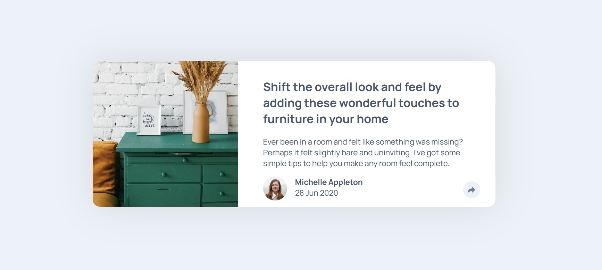

# Frontend Mentor - Article preview component solution

This is a solution to the [Article preview component challenge on Frontend Mentor](https://www.frontendmentor.io/challenges/article-preview-component-dYBN_pYFT). Frontend Mentor challenges help you improve your coding skills by building realistic projects.

## Overview

### The challenge

Users should be able to:

- View the optimal layout for the component depending on their device's screen size
- See the social media share links when they click the share icon

### Screenshot

### Links

- Solution URL: [Add solution URL here](https://your-solution-url.com)
- Live Site URL: [Add live site URL here](https://placoderm.github.io/Article-preview-component/)

## My process

### Built with

- CSS custom properties
- Flexbox
- CSS Grid

### What I learned

I learned a bit of animation, making the social media popup. Also scaling the images.

### Continued development

The positioning of the mobile share popup was really difficult and I'm not sure the way I did it is the best way.

### Useful resources

- Tool for making the arrow part of the speech bubble https://projects.verou.me/bubbly/
